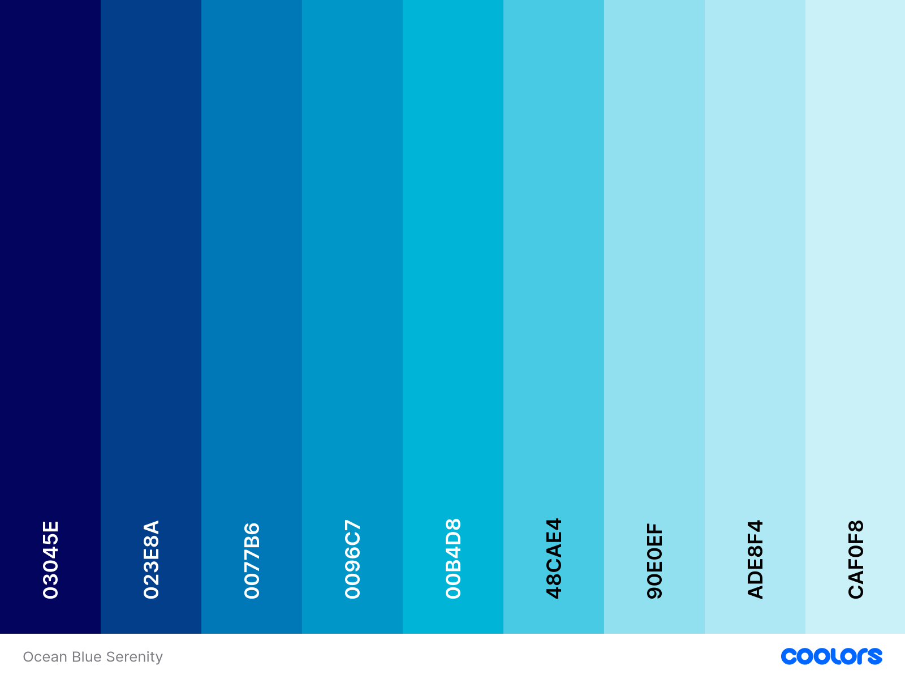
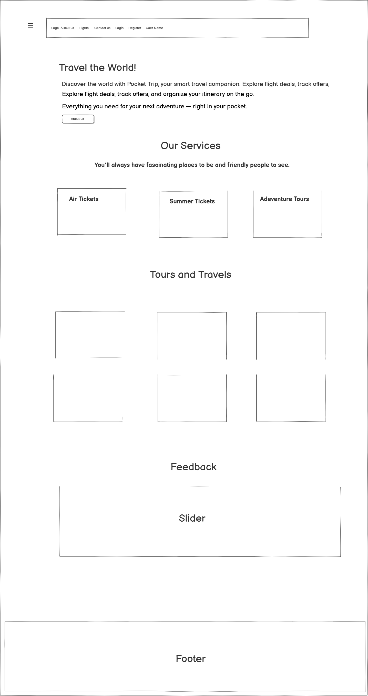
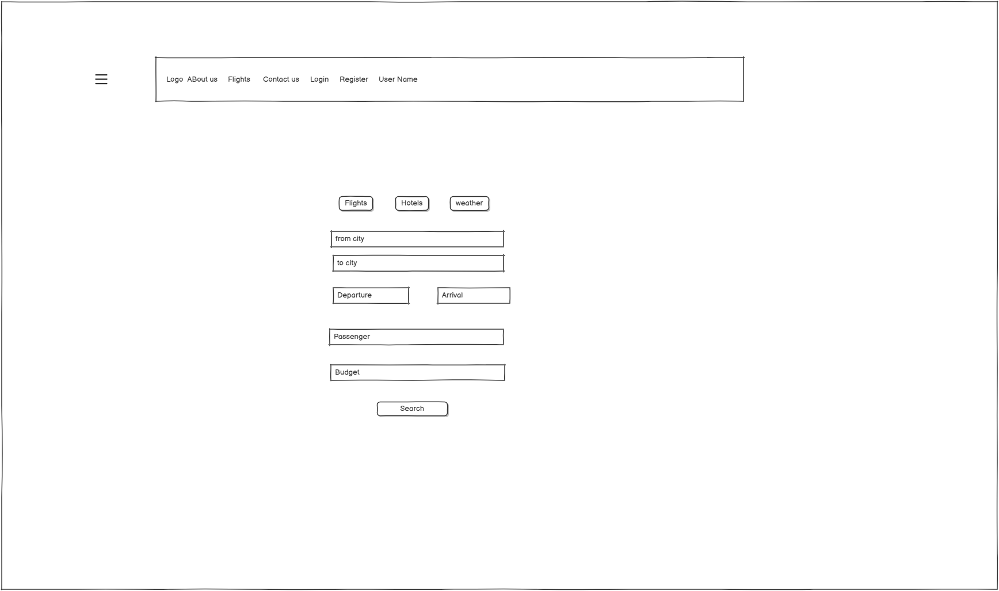
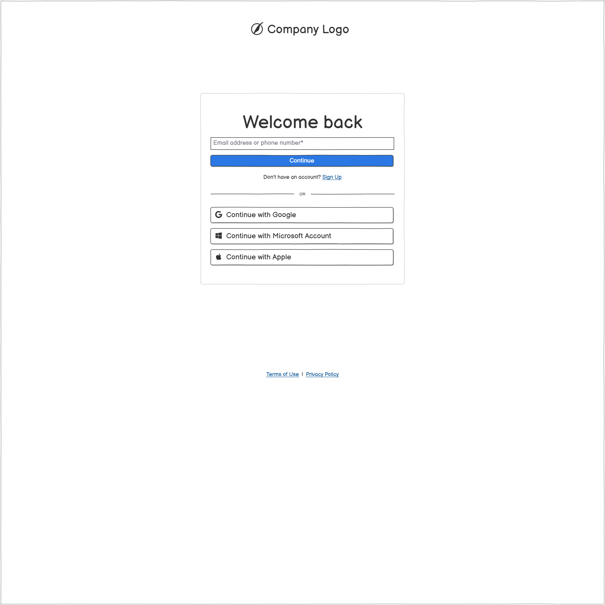
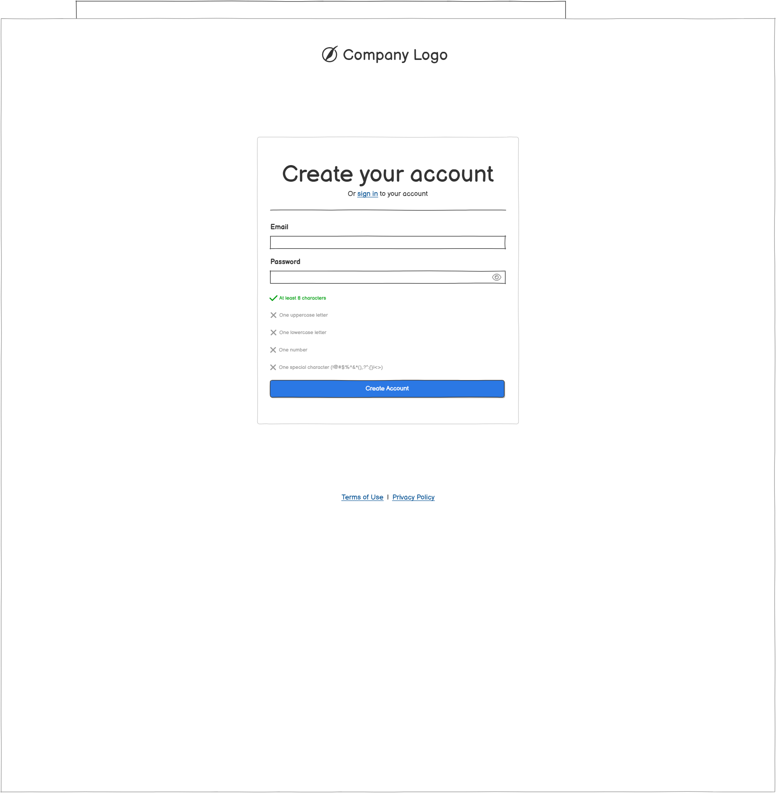
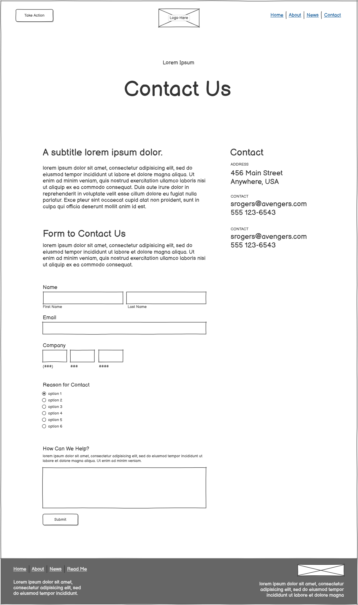
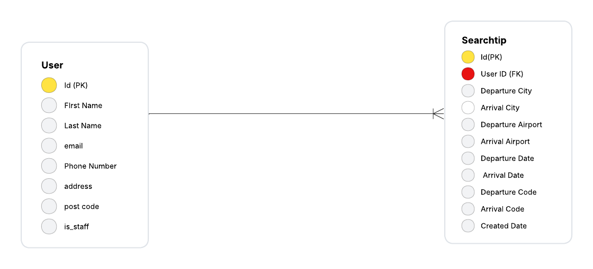
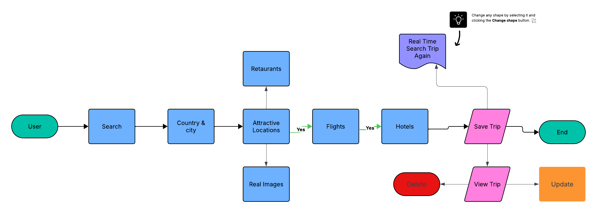
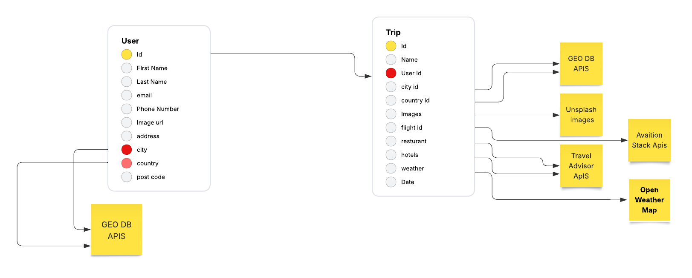

# Pocket Trip

TripPocket – keep trips in your “pocket” for later.

Top Pocket Trip is a smart travel management and flight search web application built with Django and JavaScript.

It allows users to search, compare, and organize flights, save custom filters, and manage past searches easily.

The platform includes an About Us page to share your brand story and mission, and a Contact Us page so users can reach your team directly.

Interactive features like SweetAlert2 notifications, loading indicators, and date validation enhance the user experience.

Designed to be fast, responsive, and user-friendly — perfect for travelers and small travel businesses who want efficient trip planning tools.

[View Pocket Trip on Heroku](https://pocket-trip-0b51f0f8267b.herokuapp.com/)

## CONTENTS

- [User Experience](#user-experience-ux)

  - [User Stories](#user-stories)

- [Design](#design)

  - [Colour Scheme](#colour-scheme)
  - [Typography](#typography)
  - [Imagery](#imagery)
  - [Wireframes](#wireframes)

- [Features](#features)

  - [General Features on Each Page](#general-features-on-each-page)
  - [Future Implementations](#future-implementations)
  - [Accessibility](#accessibility)

- [Technologies Used](#technologies-used)

  - [Languages Used](#languages-used)
  - [Frameworks, Libraries & Programs Used](#frameworks-libraries--programs-used)

- [Deployment & Local Development](#deployment--local-development)

  - [Deployment](#deployment)
  - [Local Development](#local-development)
    - [How to Fork](#how-to-fork)
    - [How to Clone](#how-to-clone)

- [Testing](#testing)
    [Testing File] (#testing)
  - [Manual Testing](#manual-testing)
  - [Automate Testing](#automate-testing)
  
- [Credits](#credits)
  - [Code Used](#code-used)
  - [Content](#content)
  - [Media](#media)
  - [Acknowledgments](#acknowledgments)

---

## User Experience (UX)

### Initial Discussion

As a traveler or small travel business,
I want to search, compare, and save flights easily
So that I can plan my trips efficiently, keep track of my preferred routes,
and revisit saved trips later without having to start my search from scratch.

### User Goals

Quickly search and compare flights by destination, date, and price

Save favorite trips (“keep in your pocket”) for later review

Access past searches without re-entering details

Enjoy a fast, interactive, and visually clear interface for managing travel plans

### User Stories

### User Goals

Quickly search and compare flights by destination, date, and price

Save favorite trips (“keep in your pocket”) for later review

Access past searches without re-entering details

Enjoy a fast, interactive, and visually clear interface for managing travel plans

🧳 User Stories

### As a traveler,
I want to search for flights by destination, dates, and price range,
so that I can easily find travel options that fit my budget and schedule.

### As a user,
I want to compare multiple flights side by side,
so that I can choose the best combination of price and duration.

### As a frequent traveler,
I want to save my favorite flights or routes,
so that I can revisit and book them later without repeating the search.

### As a returning user,
I want to view my previous searches,
so that I can quickly check past results and avoid entering the same details again.

### As a travel planner,
I want to filter and sort results by airline, stops, duration, or fare type,
so that I can efficiently narrow down my best options.

### As a user,
I want to receive clear notifications and validations,
so that I know when an action (like saving, deleting, or submitting a form) has succeeded or failed.

### As a site visitor,
I want to learn about the team and contact support,
so that I can trust the platform and reach out if I have questions.

### As a mobile user,
I want the platform to be fast and responsive,
so that I can plan my trips comfortably from any device

## 🧭 Additional User Stories
### About Us Page

As a new visitor,
I want to read about the company’s mission, values, and team,
so that I can understand who is behind TripPocket and why I should trust the service.

As a potential partner or investor,
I want to learn about the project’s goals and vision,
so that I can evaluate if it aligns with my interests or business objectives.

As a returning user,
I want to see updates or achievements shared by the team,
so that I can stay connected with the platform’s growth and improvements.

### Contact Us Page

As a user,
I want to send a message or inquiry directly through a contact form,
so that I can reach the TripPocket team easily without searching for emails or phone numbers.

As a traveler needing help,
I want to receive a confirmation or success message after submitting my query,
so that I know my request was received successfully.

As a business or agency,
I want to find the company’s contact details and social media links,
so that I can connect for collaborations or partnerships.

As a support team member,
I want to view user inquiries in an organized way,
so that I can respond efficiently and maintain good communication.

#### Key information for the site

🚀 Main Features

🔍 Flight Search & Comparison
Users can search for flights by destination, date, and price range, and instantly compare results side by side.

💾 Save Trips for Later
Keep your favorite flights and destinations in your “pocket” to revisit or book later.

⚙️ Custom Filters & Sorting
Save personalized filters (like price, stops, airlines, or date range) to speed up future searches.

🕓 Search History Management
View, manage, and clear previous searches directly from your dashboard.

💬 Interactive User Experience
Real-time loading indicators, SweetAlert2 notifications, and date validation for smooth interaction.

🧭 About Us & Contact Pages
Share your brand story, mission, and contact details to build user trust and engagement.

📱 Responsive & Fast
Fully optimized for mobile, tablet, and desktop, ensuring seamless performance for all users.

### Colour Scheme

Here is the color scheme for the project:

- **Federal blue**: `#03045E`
- **Marian blue**: `#023E8A`
- **Honolulu Blue**: `#0077B6`
- **Blue Green**: `#0096C7`
- **Pacific cyan**: `#00B4D8`
- **Vivid sky blue**: `#48CAE4`
- **Non Photo blue**: `#ADE8F4`
- **Light cyan**: `#CAF0F8`

 

Resource
https://coolors.co/palette/03045e-023e8a-0077b6-0096c7-00b4d8-48cae4-90e0ef-ade8f4-caf0f8

### Typography

TripPocket uses a system-optimized and web-safe font stack to ensure a consistent, readable, and fast-loading user interface across all devices and platforms.

### Font Stack

font-family: -apple-system, BlinkMacSystemFont, "Segoe UI", Roboto, "Helvetica Neue", Arial, sans-serif,
             "Apple Color Emoji", "Segoe UI Emoji", "Segoe UI Symbol", "Noto Color Emoji";

### Explanation of the stack:

1. -apple-system & BlinkMacSystemFont → Use the native system font on macOS/iOS and Chrome/Chromium browsers.

2. "Segoe UI" → Default system font for Windows.

3. Roboto → Popular font for Android and Google platforms.

4. "Helvetica Neue" & Arial → Standard web-safe fallback fonts for older systems.

5. sans-serif → Generic fallback if none of the above are available.

6. Emoji support: "Apple Color Emoji", "Segoe UI Emoji", "Segoe UI Symbol", "Noto Color Emoji" ensures emojis render properly across platforms.

### Imagery

TripPocket uses a combination of custom designs and free stock images to create an attractive, user-friendly, and consistent interface.

1. Hero & Homepage Images

Main Hero Image:

Featured prominently on the home page to welcome users.

Designed to reflect the travel theme and overall brand identity.

2. Gallery / Destinations

6 Destination Images:

Showcase different countries and popular travel locations.

Images are high-quality and royalty-free from Unsplash.

Provides inspiration and context for travelers exploring TripPocket.

3. Branding Assets

Logo:

Custom-designed using Canva to represent the TripPocket brand.

Favicon:

Designed in Canva for display in browser tabs and bookmarks.

Purpose: Establish a strong, consistent brand identity throughout the app.

4. Image Sources & Licensing

Canva: For custom graphics, logos, and favicon.

Unsplash: Free, royalty-free images used for gallery and hero visuals.

5. Purpose & UX Benefits

Enhance visual appeal and engagement.

Provide users with a sense of travel inspiration and discovery.

Ensure all assets are optimized for fast web performance.

Maintain a consistent visual identity across all pages.

### **Wireframes**

🖌️ Wireframes & UI/UX Design

The initial design and layout of this project were conceptualized using Balsamiq.
These wireframes served as the foundation for the UI/UX structure, ensuring a clear visual direction before development began.

📐 Tool used: Balsamiq

🎯 Purpose: Define layout, content hierarchy, and user flow across key pages and components.

Click to view the website wireframes online: Wireframes Link
 

Click to view the **website wireframes** [here](https://balsamiq.cloud/suw3nvv/pxfpa05/r2278).

**Home Page**

**Flight Search**

**Login**

**Sign up**

**Contact Us**

### Features

The website is contain Home page, a About us Page, a Login page, Flight Search Page, a Contact us page,and 404 page.

All Pages on the website are responsive and have:

#### Favicon

- A favicon in the browser tab.

  

  - The navigation of the site at the top of every page. link to all pages each other click on logo back to home page.

  * Home page Navigation is transparent background top of slider

#### Navigation

- Navigation of All Other pages same have login register and Flights.

* Home page Navigation is transparent background top of slider

# 🌍 Pocket Trip — Travel the World!

**Pocket Trip** is your smart travel companion — designed to help you explore the world effortlessly.  
Discover flight deals, track offers, and organize your itinerary all in one place.  
Everything you need for your next adventure — right in your pocket.

---

## ✈️ About Us
Pocket Trip connects travelers to fascinating destinations and experiences around the world.  
Our goal is to make travel planning simple, affordable, and enjoyable — so you can focus on the journey, not the logistics.

---

## 🧳 Our Services

- **Air Tickets**  
  Simplify your flight booking process and find the best deals available.

- **Summer Tour**  
  Enjoy curated summer packages to top destinations around the globe.

- **Adventure Tour**  
  Discover thrilling adventures and unique travel experiences.

---

## 🌐 Tours and Destinations

Explore popular destinations with detailed travel insights:

- **Japan**  
- **New York**  
- **United Kingdom**  
- **Indonesia**  
- **Brazil**  
- **Canada**

Each destination includes a “View Details” section for more information.

---

## 💬 Feedbacks

> “Pocket Trip made finding affordable flights so easy!  
> I booked my trip in minutes and saved money compared to other sites.  
> The interface is clean, fast, and really intuitive.”  
> — *Sarah M., Frequent Flyer*

---

## 🧭 Footer

**Dream it. Plan it. Pocket it.**

Navigation links:  
`Home` · `About` · `Contact Us` · `Login` · `Register` · `How To Use`

Social: **Facebook | Instagram**  
Search bar and mailing list subscription included for updates and announcements.

---

## ⚙️ How To Use

1. **Find** the best flight deals and tour packages.  
2. **Save** your favorite trips and compare offers.  
3. **Book** securely and start your next adventure!

---

### 📬 Join Our Mailing List
Stay updated with the latest offers, destinations, and travel tips!

---

#### Footer Structure

The footer of the Pocket Trip website is designed to provide quick access to essential links, contact details, and engagement options. The layout follows a right-to-left hierarchy, making key information immediately accessible and enhancing usability.

🧭 Footer Content (Right to Left):

1. Logo and Slogan

Positioned at the far right of the footer.

Includes the Pocket Trip logo alongside a short, memorable slogan to reinforce brand identity.

2. Contact & More Info

Contains contact details like phone numbers and support email.

May also include quick links to the help center or business inquiries.

3. Footer Navigation

A compact set of links for easy access to key pages such as:

- Home

- ABout Us

- Login

- Register

- Contact Us

4. Newsletter & Social Media Icons

Newsletter signup input (if applicable).

Social media icons (e.g., instagram , Facebook) allow users to connect with Pocket Trip on various platforms.

#### Search Page
## ✈️ Search Flights

The **Search Flights** page in **Pocket Trip** allows users to find and manage flight options efficiently with real-time validation, dynamic airport loading, and a smooth search experience.

#### 🏙️ City & Airport Selection
- **Departure City** and **Arrival City** fields support **autocomplete** — start typing to see matching cities.
- After selecting a city, the system **loads available airports** dynamically.
- A loading indicator appears until the airport list is fully loaded.
- Users must select both **departure** and **arrival** airports before proceeding.

#### 📅 Date Selection
- Users can select both **Departure Date** and **Return Date** using a date picker (`dd/mm/yyyy` format).
- If a **previous date** (past date) is selected, an **alert** appears prompting the user to choose a valid future date.
- If the **Return Date** is earlier than the **Departure Date**, an **alert** notifies the user to correct the dates.

#### ⚠️ Form Validation
- **All fields are required** before searching (cities, airports, and dates).
- Missing or invalid input triggers alerts to ensure correct data entry.

#### 🔄 Saved Searches
- The system automatically stores the most recent flight searches for quick re-access.
- Example saved routes:
  - `London → Indonesia (2025-10-25)`
  - `London → Indonesia (2025-10-24)`

#### 🚀 Search Action
- On clicking **Search**, a **loading animation** is displayed while results are being fetched.
- Once loading completes, available flight results are displayed or a “No flights found” message is shown if applicable.

---

### 🧭 Overview
This page emphasizes **usability**, **validation**, and **feedback**, ensuring users always have clear guidance while planning their trips.  
Every interaction — from typing a city name to searching for flights — provides real-time visual cues and alerts for a seamless experience.

## 💺 Search Results (Flight Options)

After performing a flight search, users are presented with multiple available flight options based on their selected **departure**, **arrival**, and **travel dates**.  
Each flight result includes detailed information about price, airline, routes, and travel duration for complete transparency.

---

### 🧾 Example Flight Result

**Price:** ~£3481.77

---

#### ✈️ Outbound Flights
**Airline:** British Airways (BA)

1. **London Heathrow Airport (LHR)** → **Kuala Lumpur International Airport (KUL)**  
   - **Departure:** 2025-10-24T21:10:00  
   - **Arrival:** 2025-10-25T17:20:00  
   - **Flight Number:** 33  
   - **Cabin Class:** PREMIUM ECONOMY  
   - **Stops:** No  
   - **Segment Time:** 13h 10m  

2. **Kuala Lumpur International Airport (KUL)** → **Soekarno-Hatta International Airport (CGK)**  
   - **Departure:** 2025-10-25T21:50:00  
   - **Arrival:** 2025-10-25T23:05:00  
   - **Flight Number:** 8161  
   - **Cabin Class:** ECONOMY  
   - **Stops:** No  
   - **Segment Time:** 2h 15m  

---

#### 🛬 Return Flights
**Airline:** British Airways (BA)

1. **Soekarno-Hatta International Airport (CGK)** → **Kuala Lumpur International Airport (KUL)**  
   - **Departure:** 2025-11-01T18:25:00  
   - **Arrival:** 2025-11-01T21:35:00  
   - **Flight Number:** 8160  
   - **Cabin Class:** ECONOMY  
   - **Stops:** No  
   - **Segment Time:** 2h 10m  

2. **Kuala Lumpur International Airport (KUL)** → **London Heathrow Airport (LHR)**  
   - **Departure:** 2025-11-01T23:20:00  
   - **Arrival:** 2025-11-02T05:25:00  
   - **Flight Number:** 34  
   - **Cabin Class:** PREMIUM ECONOMY  
   - **Stops:** No  
   - **Segment Time:** 14h 05m  

---

## 🛠️ Admin Role and Permissions

Pocket Trip includes an **Admin Dashboard** powered by Django’s built-in admin site, allowing authorized administrators to manage the platform efficiently.  

### 👑 Admin Capabilities

- **User Management**
  - View, add, edit, and delete registered users.
  - Manage account statuses, permissions, and user roles.
  - Verify and manage social accounts created via Django Allauth.

- **Travel Content Management**
  - Create, update, and delete flight data, tour packages, and destinations.
  - Review and modify saved searches or itineraries created by users.

- **API and Data Oversight**
  - Monitor flight and hotel API requests from **RapidAPI** and **Booking.com** integrations.
  - Handle exchange rate data and ensure accurate conversion rates (IDR → GBP, etc.).

- **Site Configuration**
  - Access and manage admin panel settings, widgets, and WYSIWYG (via **Django Summernote**).
  - Update static content such as homepage descriptions, promotional banners, and travel tips.

- **Feedback & Reports**
  - View and manage user feedback and error logs.
  - Oversee bug tracking and handle issues related to API limits or configuration.

### 🧑‍💼 Admin Access

Administrators log in via the **Django Admin Portal** at:  
`/admin/`

### 🧭 Features

- Displays **multiple flight options** per search query.
- Shows **detailed segment information** (departure, arrival, stops, cabin class, duration).
- Provides **real-time pricing** and updates dynamically.
- Each result includes **clear airline branding** and **organized itinerary details**.
- Designed for clarity and ease of comparison.

---

### 🎯 Overview
The **Flight Results Page** ensures travelers can easily evaluate and select the best flights for their journey.  
Each option is displayed with complete route information, ensuring transparency, reliability, and user confidence in booking.

#### Contact us Page

If you have any questions, need assistance, or want to provide feedback, we’re here to support you!

Please use the contact form on our website or send us a message with the following details:

- **Your Name:** Enter your full name so we know who is contacting us.
- **Email Address:** Provide a valid email address for us to reply.
- **Subject:** Briefly describe the purpose of your message.
- **Message:** Write your detailed message or inquiry.

We strive to respond promptly and help you with whatever you need!

## 🚀 Future Enhancements

Pocket Trip is continuously evolving to become a complete travel companion.  
The following features are planned for future updates to enhance the user experience, expand functionality, and make trip planning more seamless.

---

### 🏨 1. Hotel Booking Integration
Travelers will soon be able to **search, compare, and book hotels** directly within Pocket Trip.  

**Planned Features:**
- Integration with **hotel APIs** (Booking.com, Expedia, TripAdvisor, etc.).  
- Display **real-time pricing**, **availability**, and **user ratings**.  
- Advanced **filters** for location, amenities, and price range.  
- Ability to **save hotels** along with flight and itinerary information.

---

### 🚕 2. Local Taxi & Transport Booking
To provide a true end-to-end travel experience, Pocket Trip will integrate **taxi and transport services**.  

**Planned Features:**
- Integration with **ride-hailing APIs** (Uber, Grab, local taxi partners).  
- Real-time **price estimation** and **route tracking**.  
- **Pre-booking options** for airport transfers and daily travel.  
- Sync transport bookings with **flight arrival and departure times**.

---

### 🌦️ 3. Real-Time Weather Forecasts
Stay informed and plan better with integrated **weather updates** for your destinations.  

**Planned Features:**
- Display **current conditions** (temperature, humidity, weather type).  
- Show **7-day forecasts** on the itinerary and destination pages.  
- Visual weather icons and alerts for **rain, storms, or sunshine**.  
- Weather updates will refresh dynamically as travel dates approach.

---

### 🏞️ 4. Real-Time Destination Images
Make your trip planning more visual and inspiring with **live destination imagery**.  

**Planned Features:**
- Integration with **Google Places**, **Unsplash**, or **Pexels APIs**.  
- Show **real-time, location-based images** of landmarks and attractions.  
- Seasonal and time-sensitive visuals for realistic trip previews.  
- Option to **save favorite images** or create a visual inspiration board.

---

### 🧭 5. Tour Packages & Experiences
Pocket Trip will introduce curated **tour packages** and **guided experiences** to help travelers explore destinations effortlessly.  

**Planned Features:**
- A collection of **custom travel packages** (Adventure, Family, Cultural, Luxury).  
- Each package includes **flights, hotels, transfers, and activities**.  
- Real-time pricing, itinerary previews, and easy one-click booking.  
- Option to **customize tour packages** based on traveler preferences.  
- Integration with **local tour operators** for authentic, location-based experiences.

---

### 💡 6. Saved Plans & Smart Recommendations
Enhance your travel journey with personalization and planning tools.  

**Planned Features:**
- Save entire trips (flights, hotels, taxis, and activities) for later use.  
- **AI-driven travel recommendations** based on previous searches and preferences.  
- Smart **budget planning** and **time optimization** tools.  
- Ability to **revisit and modify saved plans** for future trips.

---

### 🌍 Overview
These enhancements aim to make Pocket Trip an **all-in-one travel ecosystem** — offering everything from flights and hotels to weather, taxis, real-time images, and curated tour experiences.  
The focus is on **ease of use, personalization, and automation**, giving travelers everything they need to plan smarter, travel farther, and enjoy more.

### ♿ Accessibility

Pocket Trip is being developed with a strong focus on **accessibility and inclusivity**.  
The goal is to ensure every traveler — regardless of device, ability, or background — can explore and plan trips with ease.

---

#### 🧭 Accessibility Goals

- **Keyboard Navigation Support**  
  All interactive elements (buttons, menus, forms) are accessible using only the keyboard.

- **Screen Reader Compatibility**  
  Proper **ARIA labels**, **semantic HTML**, and **alt text** are implemented to ensure clear descriptions for users of assistive technologies like NVDA, VoiceOver, and JAWS.

- **High Contrast & Readability**  
  Color combinations and text styles follow **WCAG 2.1 AA** contrast standards to ensure comfortable readability in all lighting conditions.

- **Responsive Design**  
  The interface adapts seamlessly across devices — desktops, tablets, and mobile phones — maintaining accessibility and usability.

- **Error & Alert Accessibility**  
  Alerts for invalid dates, missing fields, or incorrect inputs are announced and visible to all users.  
  Clear error messages guide users to correct mistakes without confusion.

- **Font Scaling & Zoom Compatibility**  
  Text elements remain clear and functional when users apply browser zoom or custom font sizes.

- **Language & Localization**  
  Future versions will include **multi-language support**, ensuring accessible travel planning for global users.

---

## Technologies Used

## ⚙️ API Integration & Tech Stack

Pocket Trip leverages **modern APIs and frameworks** to deliver real-time travel data and a seamless booking experience.

---

### 🌐 APIs

#### **RapidAPI**
- Provides access to **flight data, airport info, and other travel services**.
- Powers features like:
  - Flight search with real-time pricing
  - Airport selection and dynamic loading
  - Flight segments, stops, and cabin class info
- Handles **loading states**, **error alerts**, and ensures smooth user interaction.

#### **Booking.com API**
- Used for **hotel search, booking, and availability**.
- Supports:
  - Real-time hotel listings and rates
  - Filter by amenities, location, and price
  - Saving hotels to user itineraries
- Enables **end-to-end travel planning** by combining flights and accommodations.

---

### 🧰 Tech Stack

- **Backend:** Django  
  - Handles API requests, user management, and itinerary storage  
  - Integrates seamlessly with RapidAPI and Booking.com API  
  - Provides secure endpoints for frontend requests

- **Frontend:** HTML, CSS, JavaScript (or framework of choice)  
  - Dynamic, responsive UI  
  - Real-time flight and hotel search experience  
  - User-friendly alerts and saved searches

- **Database:** PostgreSQL / SQLite  
  - Stores user accounts, saved searches, itineraries, and plans  

- **Security & Environment**
  - API keys stored in **environment variables** (`.env`)  
  - Proper error handling for network/API issues  
  - Sanitized inputs for all user-facing forms

---

### 🔍 Why This Stack?

- **Django** provides a secure, scalable backend with ORM and authentication out of the box.  
- **RapidAPI** centralizes multiple travel APIs for fast integration.  
- **Booking.com API** adds full hotel booking functionality.  
- Combined, they allow **Pocket Trip** to be a complete travel platform: flights, hotels, itineraries, and future transport/weather integrations.

---

## 📦 Django Packages & Libraries

Pocket Trip leverages several Django packages to enhance functionality, improve user experience, and streamline development.

## 🗺️ Entity Relationship Diagram (ERD)

Below is the ERD representing the database relationships in **Pocket Trip** — including users, searches, itineraries, flights, and saved trips.

---

## 🧩 Application Flowchart

The flowchart below outlines the user journey and application logic within **Pocket Trip** — from initiating a search to displaying flight results.

### ✈️ Flow Overview
1. **User Inputs:**
   - User enters departure city, arrival city, and travel dates.  
   - Validation checks ensure all fields are filled and dates are valid.  

2. **Backend Logic:**
   - Django handles the form submission.  
   - RapidAPI is called to fetch flight data.  
   - Results are filtered and formatted for display.  

3. **Display & Storage:**
   - Flight options are displayed to the user.  
   - Search parameters are saved to the database for future reference.  

4. **User Actions:**
   - Users can save, delete, or re-run previous searches.  
   - They can navigate to hotels, tours, or taxi booking in future updates.  

This diagram provides a **high-level understanding** of how Pocket Trip processes user interactions and integrates with external APIs.

---

### 🔑 Authentication & User Management
- **django-allauth**  
  - Handles **user registration, login, social authentication, and account management**.  
  - Provides email verification, password reset, and multi-provider login support.

---

### 🎨 Forms & UI Enhancements
- **django-crispy-forms**  
  - Simplifies form rendering with clean HTML and DRY templates.  
  - Supports integration with **Bootstrap** or other CSS frameworks.  

- **crispy-bootstrap5**  
  - Provides **Bootstrap 5 layout support** for crispy forms.  
  - Ensures forms are **responsive and visually consistent** across devices.  

- **django-widget-tweaks**  
  - Allows **customization of form widgets** in templates without changing the Python code.  
  - Supports adding CSS classes, attributes, or custom HTML wrappers.

---

### 📝 Rich Text & Content Management
- **django-summernote**  
  - Adds a **rich text editor** for creating or editing content.  
  - Used in admin pages or user-generated content forms for formatting text, images, and links.

---

### 🛠️ Admin Enhancements
- **Django Admin (built-in)**  
  - Custom admin dashboard for managing **users, itineraries, flights, hotels, and packages**.  
  - Fully integrated with the database models and Django packages.

---

### 🔍 Benefits
- Speeds up **backend development** and **form handling**  
- Enhances **admin and user interfaces**  
- Provides **secure, scalable authentication**  
- Makes **rich content management** simple and maintainable

---

## 🗄️ Database & Deployment

Pocket Trip uses a robust backend setup with **PostgreSQL** for data storage and **Heroku** for deployment, ensuring scalability, reliability, and smooth user experiences.

---

### 🛢️ Database: PostgreSQL
- **Type:** Relational database management system (RDBMS)  
- **Usage:** Stores user accounts, saved searches, itineraries, flight and hotel bookings, and preferences  
- **Integration:** Fully connected to Django backend using Django ORM  
- **Features:**
  - Supports complex queries for search and itinerary management
  - Secure storage of user data
  - Easy scalability for growing user base

---

### 🚀 Deployment: Heroku
- **Platform-as-a-Service (PaaS):** Host the full Django application with a cloud database  
- **Features:**
  - Automatic environment configuration
  - Simple Git-based deployment pipeline
  - Scalable dynos for handling user traffic
  - Integrated with **PostgreSQL add-on** for live database

- **Deployment Pipeline:**
  1. Code pushed to Git repository
  2. Heroku automatically builds the Django project
  3. Environment variables (API keys, database credentials) securely configured
  4. Application deployed and served live with HTTPS support
  5. Continuous updates handled via Git push and automated rebuilds

---

### 🔧 Benefits
- **Reliable hosting** with minimal maintenance overhead  
- **Scalable database** for growing user base and data  
- **Secure API key and database management** using environment variables  
- **Streamlined CI/CD pipeline** through Git and Heroku deployment

### Frameworks, Libraries & Programs Used

- [Balasmiq](https://balsamiq.cloud/) - Used to create wireframes.

- [Git](https://git-scm.com/) - For version control.

- [Github](https://github.com/) - To save and store the files for the website.

- [Chat GPT](https://chatgpt.com/) - Creating my slider Images amd help for content writing.

- [Font Awesome](https://fonts.google.com/) - To import the fonts used on the website.

- [jQuery](https://jquery.com/) - A JavaScript library.

- [Google Developer Tools](https://developers.google.com/web/tools) - To troubleshoot and test features, solve issues with responsiveness and styling.

- [TinyPNG](https://tinypng.com/) To compress images

- [Birme](https://www.birme.net/) To resize images and convert to webp format.

- [Favicon.io](https://favicon.io/) To create favicon.

- [Am I Responsive?](http://ami.responsivedesign.is/) To show the website image on a range of devices.

- [Shields.io](https://shields.io/) To add badges to the README

- [JSON Formatter](https://chrome.google.com/webstore/detail/json-formatter/bcjindcccaagfpapjjmafapmmgkkhgoa) - a google chrome extension to enable you to view JSON as raw data or parsed.

- [Webpage Spell-Check](https://chrome.google.com/webstore/detail/webpage-spell-check/mgdhaoimpabdhmacaclbbjddhngchjik/related) - a google chrome extension that allows you to spell check your webpage. Used to check the site and the readme for spelling errors.

### Local Development

#### How to Fork

To fork the repository:

1. Log in (or sign up) to Github.
2. Go to the repository for this project, [Mubashirgit1/trip-pocket](https://github.com/Mubashirgit1/trip-pocket)
3. Click the Fork button in the top right corner.

#### How to Clone

To clone the repository:

1. Log in (or sign up) to GitHub.
2. Go to the repository for this project, [Mubashirgit1/trip-pocket](https://github.com/Mubashirgit1/trip-pocket)
3. Click on the code button, select whether you would like to clone with HTTPS, SSH or GitHub CLI and copy the link shown.
4. Open the terminal in your code editor and change the current working directory to the location you want to use for the cloned directory.
5. Type 'git clone' into the terminal and then paste the link you copied in step 3. Press enter.

## Testing

Please refer to [TESTING.md](/docs/testing.md) file for all testing carried out.

## 🧪 Automated and Manual Testing

### 🧍 Manual Testing

Manual testing involves a human tester verifying that each feature of Pocket Trip functions correctly from a user perspective.  
This includes searching flights, managing saved searches, validating forms, and ensuring proper navigation.

---

#### **Scenario 1: Testing Flight Search Functionality**

1. Open the Pocket Trip website in a browser.  
2. Go to the **Search Flights** page.  
3. Enter a valid **Departure City** and **Arrival City**.  
4. Wait for airport lists to load and select one for each.  
5. Choose valid **Departure** and **Return** dates.  
6. Click the **Search** button.  
7. Confirm that flight results display correctly with:
   - Airline name  
   - Flight number  
   - Cabin class  
   - Price and duration  
8. Attempt to:
   - Select a **past date** → Alert should appear requesting a valid date.  
   - Select **Return Date earlier than Departure Date** → Alert should appear.  
   - Leave a field empty → Alert should indicate that all fields are required.  

---

#### **Scenario 2: Testing Saved Searches and Management**

1. Perform a few successful flight searches.  
2. Verify that each search automatically appears in the **Saved Searches** list.  
3. Click a **saved search** → Confirm it reloads previous cities, dates, and filters into the search form.  
4. Modify the filters (e.g., change destination or date) and click **Search** again → Ensure updated results appear and overwrite or add a new entry.  
5. Test the **Delete button** beside each saved search:
   - Confirm the search entry is removed immediately from the list.  
   - Refresh the page to verify it stays deleted (persistent removal).  
6. Edit an existing saved search:
   - Click the **Edit icon/button** beside a saved entry.  
   - Update cities, airports, or dates.  
   - Save changes → Verify the list updates and reflects new details.  
7. Confirm the “Re-run Search” feature works:
   - Click a previous filter or saved search.
   - Verify that the search form auto-fills and results refresh without re-entering data manually.  

---

#### **Scenario 3: Testing Navigation and Links**

1. Verify **navbar links** (Home, About, Contact Us, Login, Register, How To Use) redirect correctly.  
2. Test **footer links** and ensure they lead to valid pages.  
3. Click **social icons** (Facebook, Instagram) — they should open in a new tab.  
4. Submit **Contact Us** form → Confirm success message appears.  
5. Test an invalid URL → Custom **404 Page** should display.  

---

#### **Scenario 4: Testing Form Validation & Alerts**

1. Leave any required field empty → Alert should indicate missing input.  
2. Enter invalid or misspelled city → Show alert or validation error.  
3. Select a **past departure date** → Alert prevents submission.  
4. Select a **return date before departure** → Alert prevents search.  
5. Observe that a **loading spinner** or message appears when fetching airports or results.

---

### 🤖 Automated Regression & Repeatable Tasks

Automation ensures stable performance during future updates.  
You can use **Django’s built-in test framework**, **PyTest**, or **Selenium** for UI automation.

#### **Recommended Automated Tests**

1. **Search Form Tests**
   - Validate correct form submission and alerts for invalid inputs.  
   - Simulate API responses from RapidAPI to confirm correct handling.  

2. **Saved Search Tests**
   - Automatically verify saving, editing, deleting, and re-running saved searches.  
   - Check that database records update properly after edits or deletions.  

3. **Navigation Tests**
   - Ensure all nav and footer links route to valid pages.  

4. **404 Page Tests**
   - Confirm invalid URLs redirect to the custom 404 page.  

5. **Performance Tests**
   - Measure response time when performing multiple flight searches or re-running filters.  

---

#### **Regression Testing**
Re-run automated tests after:
- Adding new features (e.g., tour packages, hotel search, etc.)
- Updating the Django or API integration
- Modifying database models or URLs  

Ensure all core functionality — search, saved searches, alerts, and validations — continues to work as expected.

---

### ✅ Testing Summary

- Manual testing validates **user experience and interface behavior**.  
- Automated testing ensures **stability and reliability** during development cycles.  
- Combined, they guarantee that Pocket Trip remains **user-friendly, accurate, and dependable**.  

---

### Solved Bugs

---

## 🐛 Solved Bugs

During the development and deployment of **Pocket Trip**, several technical issues were identified and resolved to ensure a smooth, responsive, and stable user experience.

---

### ✅ 1. Input Validation on Search Page
**Issue:**  
Users could search with incomplete fields, past dates, or return dates earlier than departure.  

**Fix:**  
- Added strict **frontend and backend validation** in Django and JavaScript.  
- Prevents searches with missing fields or invalid date ranges.  
- Displays clear alert messages to guide users.

**Result:**  
Ensures data accuracy and prevents incorrect or empty flight queries.

---

### ✅ 2. Currency Conversion (IDR → GBP)
**Issue:**  
Flight prices returned by the API were in **Indonesian Rupiah (IDR)**, confusing users expecting British Pounds.  

**Fix:**  
Implemented **automatic backend currency conversion** to display prices in **GBP (£)** using exchange rate data.  

**Result:**  
All flight listings now show prices consistently in Pounds Sterling.

---

### ✅ 3. Allauth Signup Page Styling with Crispy Forms
**Issue:**  
Default Django-Allauth signup/login pages were not responsive or styled.  

**Fix:**  
- Integrated **`django-crispy-forms`**, **`crispy-bootstrap5`**, and **`django-widget-tweaks`**.  
- Applied consistent Bootstrap styling for all forms.  
- Adjusted layout for responsiveness on mobile and desktop.  

**Result:**  
A visually appealing and mobile-friendly authentication flow.

---

### ✅ 4. CRUD Operations with JavaScript
**Issue:**  
CRUD actions (edit, delete, re-run saved searches) required page reloads, slowing down UX.  

**Fix:**  
Added **asynchronous JavaScript functions** using `fetch()` for instant updates:  
- Delete and edit searches dynamically.  
- Show confirmation toasts.  
- Re-run previous search filters seamlessly.  

**Result:**  
Improved interactivity and smoother user workflow without reloading the page.

---

### ✅ 5. RapidAPI Key Limit and No Response Issue
**Issue:**  
After two days, flight data stopped loading due to **RapidAPI request limits**.  

**Fix:**  
- Diagnosed the issue using Heroku logs (`heroku logs --tail`).  
- Added error handling for API timeouts and non-200 responses.  
- Generated a new **RapidAPI key** and updated it using Heroku config vars.  
- Implemented retry logic and basic caching to prevent hitting limits again.  

**Result:**  
Reliable API performance with automatic recovery from failures or quota resets.

---

### ✅ 6. Heroku Allauth Configuration and Database Connectivity
**Issue:**  
Deployment on Heroku caused login redirects to fail and database connections to drop intermittently.  

**Fix:**  
- Set `ALLOWED_HOSTS` to include the Heroku domain.  
- Configured all `django-allauth` environment variables via `heroku config:set`.  
- Integrated `dj-database-url` with `ssl_require=True` for secure PostgreSQL connections.  
- Ran migrations and collected static files through Heroku CLI.  

**Result:**  
Stable authentication, database operations, and full pipeline deployment.

---

### ✅ 7. Heroku Pipeline Setup and CI/CD
**Issue:**  
Manual deployment steps risked inconsistencies between staging and production environments.  

**Fix:**  
- Created a **Heroku pipeline** for staging and production.  
- Connected to GitHub for **automatic deploys**.  
- Added release phase in `Procfile` for automatic migrations.  

**Result:**  
Smooth, continuous deployment process with version tracking and rollback support.

---

### ✅ 8. API Synchronization and Loading Indicators
**Issue:**  
Flight results and airport lists didn’t always load together, showing incomplete data.  

**Fix:**  
- Added loading spinners while fetching data.  
- Ensured asynchronous API calls complete before rendering results.  
- Added error handling for partial responses.  

**Result:**  
Consistent, complete, and user-friendly search experience.

---

### ✅ 9. Database and Pipeline Configuration
**Issue:**  
Initial PostgreSQL setup on Heroku failed due to missing SSL settings.  

**Fix:**  
- Added `dj-database-url` with `conn_max_age` and `ssl_require=True`.  
- Re-ran migrations and confirmed connection with `heroku run python manage.py migrate`.  
- Verified pipeline linking and environment consistency between staging and production.  

**Result:**  
Fully functional PostgreSQL integration and secure database connections.

---

### ✅ 10. Validation and Error Handling Enhancements
**Fix Summary:**  
- All search form fields are required.  
- Past dates are restricted.  
- Alerts added for invalid return/departure combinations.  
- Added “Searching flights...” loading states for better UX.  

**Result:**  
Professional, reliable user interactions with clear feedback on errors and loading progress.

---

## 🐞 Known Bugs

While **Pocket Trip** is fully functional, there are a few limitations and pending issues to be aware of:

---

### 1. API Rate Limits
- **Issue:** RapidAPI calls may fail when the daily quota is exceeded.  
- **Impact:** Flight search may not return results until the quota resets or a new API key is applied.  
- **Workaround:** Limit repeated searches for the same routes and monitor API usage.  

---

### 2. Hotel, Taxi, and Tour Integration (Future)
- **Issue:** These modules are planned but not yet fully integrated.  
- **Impact:** Users cannot book hotels, taxis, or tours directly through the app yet.  
- **Workaround:** Users can save searches and plan manually until the feature is implemented.  

---

### 3. Real-Time Images and Weather
- **Issue:** The real-time location images and weather APIs are under development.  
- **Impact:** Destinations currently show only static placeholders without live updates.  
- **Workaround:** Users can still view flights and saved searches normally.  

---

### 4. Slow API Responses for Certain Routes
- **Issue:** Some flight searches may take longer due to provider response times.  
- **Impact:** Delays in loading search results may occur occasionally.  
- **Workaround:** Loading indicators are present; users should wait a few seconds for results to appear.  

---

### 5. Limited Offline Functionality
- **Issue:** Pocket Trip relies on API calls and requires an active internet connection.  
- **Impact:** No offline search or saved flight updates are available.  
- **Workaround:** Users can view previously saved searches, but new searches require connectivity.  

---

### 6. Social Login Redirect Edge Cases
- **Issue:** Rarely, social login (Google/Facebook) redirects may fail due to provider misconfiguration or outdated tokens.  
- **Impact:** User may need to retry login or use email/password authentication.  
- **Workaround:** Check social provider keys and redirect URIs if persistent.  

---

**Note:** All bugs listed are either minor or planned for future releases. The core functionality of flight search, saved searches, and CRUD operations is stable and fully operational.  

---

## 🙏 Credits

The **Pocket Trip** project was made possible thanks to contributions, resources, and mentorship from the following sources:

### Project Design & Development
- Main development, layout, and README content authored by the project team.

### Error Solutions & Guidance
- Assistance in debugging, error resolution, and best practices provided by **ChatGPT** (OpenAI), which helped in understanding issues and implementing solutions.

### APIs & Live Data Sources
- **RapidAPI** – for fetching live flight data.  
- **Booking.com API** – for retrieving hotel availability and booking details in real time.  
- **Exchange Rate APIs** – for currency conversion (IDR → GBP and other rates).  

### Learning Resources
- **Code Institute** – for Python, Django, and full-stack development learning materials.  
- **Graeme Taylor (Tutor & Mentor)** – Huge thanks to Graeme Taylor for guidance throughout this project. His feedback, technical support, and encouragement helped me navigate challenges, learn best practices, and successfully complete the project.
- **Manuel Perez Romero (City of Bristol College)** – For his academic support and oversight during the development phase. His involvement ensured the project stayed on track and met all educational standards.  
  - Email: Manuel.PerezRomero@cityofbristol.ac.uk

### Technologies Used
- Django & Django REST Framework  
- PostgreSQL  
- Heroku Deployment Pipeline  
- Crispy Forms, Bootstrap, Summernote, Widget Tweaks, Allauth  

**Acknowledgment:**  
Special thanks to all the above for providing knowledge, guidance, APIs, and tools that enabled the successful development of **Pocket Trip**, including live searching, booking features, and robust error handling.

### Acknowledgments

The development of Pocket Trip was supported and influenced by several individuals and tools. Sincere thanks to the following for their contributions and inspiration:

👨‍🏫 Graeme Taylor – My tutor and mentor throughout the project. His technical guidance, structured feedback, and consistent encouragement were key to completing and refining the application.

📩 Manuel Perez Romero – For his academic support and oversight during the development phase. His involvement helped ensure the project stayed on track and met all educational standards.
Email: Manuel.PerezRomero@cityofbristol.ac.uk

#### Favicon

- A favicon in the browser tab.

  

#### Web APP LOGO

- A Logo.

  

### User Stories

## 🌍 Pocket Trip – User Stories

### 👤 As a Traveler (Main User)

#### 🧭 1. Search & Explore

- **Story 1:** As a traveler, I want to **search for flights** so that I can find the best options for my destination.  
- **Story 2:** As a traveler, I want to **search for hotels** so that I can book comfortable accommodation.  
- **Story 3:** As a traveler, I want to **view nearby restaurants** so that I can plan my meals during the trip.  
- **Story 4:** As a traveler, I want to **see current weather information** for my destination so that I can prepare accordingly.  
- **Story 5:** As a traveler, I want to **view real-time pictures** of destinations so that I can see what the place looks like before I go.  

---

#### 🧳 2. Trip Management

- **Story 6:** As a traveler, I want to **create a trip plan** so that I can organize my travel details in one place.  
- **Story 7:** As a traveler, I want to **save a trip** in the app so that I can access it later.  
- **Story 8:** As a traveler, I want to **view all my saved trips** so that I can review or modify them.  
- **Story 9:** As a traveler, I want to **update trip details** (like dates, destination, or activities) so that my plan stays current.  
- **Story 10:** As a traveler, I want to **delete a trip** if I cancel my plans or no longer need it.  

---

#### 🖼️ 3. Media & Sharing

- **Story 11:** As a traveler, I want to **see real-time user-submitted pictures** of locations so that I get authentic views of the place.  

## 🧩 System Architecture

## 🧱 Entity Relationship Diagram (ERD)

### 📊 ERD Overview

- **User**: Stores personal details such as name, email, phone, and location info.  
- **Trip**: Connected to the User model via `user_id`. Contains trip details, images, flights, restaurants, and weather data.  
- **External APIs**:
  - **GEO DB API** → Provides city and country info  
  - **Unsplash API** → Retrieves destination images  
  - **Travel Advisor API** → Fetches restaurants and hotels  
  - **Aviation Stack API** → Flight details  
  - **OpenWeatherMap API** → Real-time weather  

### Frameworks, Libraries & Programs Used

- [balsamiq](https://www.balsamiq.com/design) - Used to create wireframes.

- [Git](https://git-scm.com/) - For version control.

- [Github](https://github.com/) - To save and store the files for the website.

- [Chat GPT](https://chatgpt.com/) - Creating my slider Images amd help for content writing.

- [Font Awesome](https://fonts.google.com/) - To import the fonts used on the website.

- [jQuery](https://jquery.com/) - A JavaScript library.

- [Google Developer Tools](https://developers.google.com/web/tools) - To troubleshoot and test features, solve issues with responsiveness and styling.

- [TinyPNG](https://tinypng.com/) To compress images

- [Birme](https://www.birme.net/) To resize images and convert to webp format.

- [Favicon.io](https://favicon.io/) To create favicon.

- [Am I Responsive?](http://ami.responsivedesign.is/) To show the website image on a range of devices.

- [Shields.io](https://shields.io/) To add badges to the README

- [JSON Formatter](https://chrome.google.com/webstore/detail/json-formatter/bcjindcccaagfpapjjmafapmmgkkhgoa) - a google chrome extension to enable you to view JSON as raw data or parsed.

- [Webpage Spell-Check](https://chrome.google.com/webstore/detail/webpage-spell-check/mgdhaoimpabdhmacaclbbjddhngchjik/related) - a google chrome extension that allows you to spell check your webpage. Used to check the site and the readme for spelling errors.

- [All Auth](https://docs.allauth.org/en/latest/) to configure User Authentication

- [gunicorn](https://shields.io/) for deployment 

- [Whitenose](https://shields.io/) for handling static files

- [psychopg2](https://shields.io/) for Databse connection

- [Django](https://shields.io/) Python Framework
