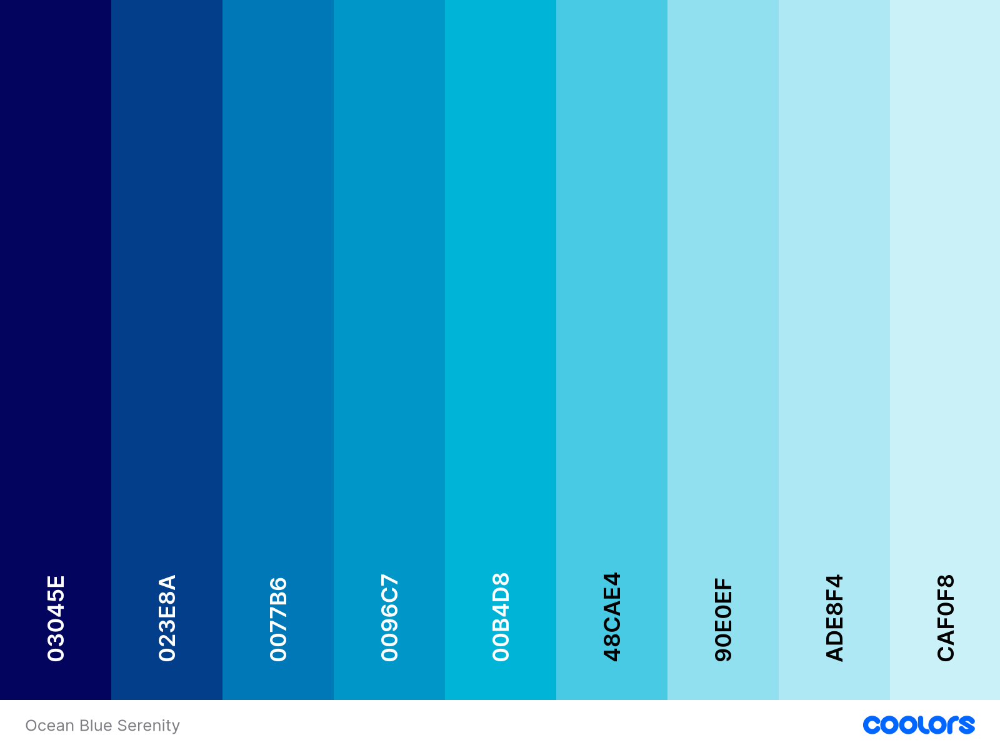

# trip-pocket
TripPocket – keep trips in your “pocket” for later.

#### Favicon

- A favicon in the browser tab.

  

#### Web APP LOGO

- A Logo.

  

### Colour Scheme

Here is the color scheme for the project:

- **Federal blue**: `#03045E`
- **Marian blue**: `#023E8A`
- **Honolulu Blue**: `#0077B6`
- **Blue Green**: `#0096C7`
- **Pacific cyan**: `#00B4D8`
- **Vivid sky blue**: `#48CAE4`
- **Non Photo blue**: `#ADE8F4`
- **Light cyan**: `#CAF0F8`

 

Resource
https://coolors.co/palette/03045e-023e8a-0077b6-0096c7-00b4d8-48cae4-90e0ef-ade8f4-caf0f8

### User Stories

## 🌍 Trip Pocket – User Stories

### 👤 As a Traveler (Main User)

#### 🧭 1. Search & Explore

- **Story 1:** As a traveler, I want to **search for flights** so that I can find the best options for my destination.  
- **Story 2:** As a traveler, I want to **search for hotels** so that I can book comfortable accommodation.  
- **Story 3:** As a traveler, I want to **view nearby restaurants** so that I can plan my meals during the trip.  
- **Story 4:** As a traveler, I want to **see current weather information** for my destination so that I can prepare accordingly.  
- **Story 5:** As a traveler, I want to **view real-time pictures** of destinations so that I can see what the place looks like before I go.  

---

#### 🧳 2. Trip Management

- **Story 6:** As a traveler, I want to **create a trip plan** so that I can organize my travel details in one place.  
- **Story 7:** As a traveler, I want to **save a trip** in the app so that I can access it later.  
- **Story 8:** As a traveler, I want to **view all my saved trips** so that I can review or modify them.  
- **Story 9:** As a traveler, I want to **update trip details** (like dates, destination, or activities) so that my plan stays current.  
- **Story 10:** As a traveler, I want to **delete a trip** if I cancel my plans or no longer need it.  

---

#### 🖼️ 3. Media & Sharing

- **Story 11:** As a traveler, I want to **see real-time user-submitted pictures** of locations so that I get authentic views of the place.  

## 🧩 System Architecture

## 🧱 Entity Relationship Diagram (ERD)

### 📊 ERD Overview

- **User**: Stores personal details such as name, email, phone, and location info.  
- **Trip**: Connected to the User model via `user_id`. Contains trip details, images, flights, restaurants, and weather data.  
- **External APIs**:
  - **GEO DB API** → Provides city and country info  
  - **Unsplash API** → Retrieves destination images  
  - **Travel Advisor API** → Fetches restaurants and hotels  
  - **Aviation Stack API** → Flight details  
  - **OpenWeatherMap API** → Real-time weather  

### Frameworks, Libraries & Programs Used

- [balsamiq](https://www.balsamiq.com/design) - Used to create wireframes.

- [Git](https://git-scm.com/) - For version control.

- [Github](https://github.com/) - To save and store the files for the website.

- [Chat GPT](https://chatgpt.com/) - Creating my slider Images amd help for content writing.

- [Font Awesome](https://fonts.google.com/) - To import the fonts used on the website.

- [jQuery](https://jquery.com/) - A JavaScript library.

- [Google Developer Tools](https://developers.google.com/web/tools) - To troubleshoot and test features, solve issues with responsiveness and styling.

- [TinyPNG](https://tinypng.com/) To compress images

- [Birme](https://www.birme.net/) To resize images and convert to webp format.

- [Favicon.io](https://favicon.io/) To create favicon.

- [Am I Responsive?](http://ami.responsivedesign.is/) To show the website image on a range of devices.

- [Shields.io](https://shields.io/) To add badges to the README

- [JSON Formatter](https://chrome.google.com/webstore/detail/json-formatter/bcjindcccaagfpapjjmafapmmgkkhgoa) - a google chrome extension to enable you to view JSON as raw data or parsed.

- [Webpage Spell-Check](https://chrome.google.com/webstore/detail/webpage-spell-check/mgdhaoimpabdhmacaclbbjddhngchjik/related) - a google chrome extension that allows you to spell check your webpage. Used to check the site and the readme for spelling errors.

- [All Auth](https://docs.allauth.org/en/latest/) to configure User Authentication

- [gunicorn](https://shields.io/) for deployment 

- [Whitenose](https://shields.io/) for handling static files

- [psychopg2](https://shields.io/) for Databse connection

- [Django](https://shields.io/) Python Framework
